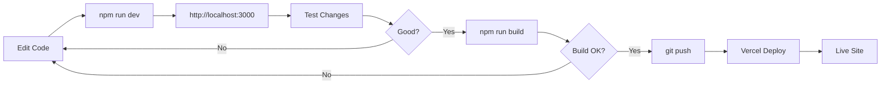

# Portfolio Website - Complete File Structure

```
portfolio-website/
│
├── 📄 Configuration Files
│   ├── package.json                 # Project dependencies and scripts
│   ├── package-lock.json            # Locked dependency versions
│   ├── tsconfig.json                # TypeScript configuration
│   ├── tailwind.config.ts           # Tailwind CSS theme configuration
│   ├── postcss.config.js            # PostCSS plugins (Tailwind)
│   ├── next.config.js               # Next.js configuration
│   ├── next-env.d.ts                # Next.js TypeScript declarations
│   ├── .eslintrc.json               # ESLint linting rules
│   ├── .gitignore                   # Git ignore patterns
│   └── vercel.json                  # Vercel deployment configuration
│
├── 📚 Documentation Files
│   ├── README.md                    # Technical documentation
│   ├── DEPLOYMENT.md                # Vercel deployment guide
│   ├── CONTENT-GUIDE.md             # How to update content
│   ├── PROJECT-SUMMARY.md           # Project overview
│   ├── CHECKLIST.md                 # Pre-deployment checklist
│   └── FILE-STRUCTURE.md            # This file
│
├── 📁 src/                          # Source code directory
│   ├── app/                         # Next.js App Router
│   │   ├── layout.tsx               # Root layout with metadata & theme
│   │   ├── page.tsx                 # Home page (combines all sections)
│   │   └── globals.css              # Global CSS & Tailwind imports
│   │
│   └── components/                  # React components
│       ├── navigation.tsx           # ⚡ Sticky nav with mobile menu
│       ├── hero.tsx                 # 🎯 Hero section with profile
│       ├── about.tsx                # 📝 About me section
│       ├── skills.tsx               # 🛠️  Skills by category
│       ├── projects.tsx             # 💼 Projects with PDF viewer
│       ├── experience.tsx           # 💼 Work experience timeline
│       ├── education.tsx            # 🎓 Education & certifications
│       ├── contact.tsx              # 📧 Contact info & social links
│       ├── section.tsx              # 📦 Reusable section wrapper
│       ├── theme-provider.tsx       # 🌙 Dark mode context provider
│       └── theme-toggle.tsx         # 🌙 Dark/light mode toggle
│
├── 📁 public/                       # Static assets (served at root)
│   ├── passport-photo.jpeg          # 📸 Profile photo (Hero section)
│   ├── AWS Multitier...pdf          # 📄 Project 1 PDF
│   ├── Virtual Machine...pdf        # 📄 Project 2 PDF
│   └── resume.pdf                   # 📄 Your resume (add this!)
│
├── 📁 node_modules/                 # Dependencies (npm install)
│   └── (337 packages)
│
└── 📁 .next/                        # Next.js build output (auto-generated)
    └── (build cache & compiled code)
```

## Component Relationships

```
layout.tsx
    ↓
page.tsx
    ├── Navigation
    ├── Hero
    ├── About
    ├── Skills
    ├── Projects
    ├── Experience
    ├── Education
    └── Contact

theme-provider.tsx
    ↓
theme-toggle.tsx (used in Navigation)
```

## Data Flow

```
Public Assets:
    public/passport-photo.jpeg → hero.tsx
    public/*.pdf → projects.tsx (PDF modal)
    public/resume.pdf → hero.tsx (Download button)

Theme:
    theme-provider.tsx → Entire app
    theme-toggle.tsx → User interaction
    tailwind.config.ts → Dark mode classes
```

## File Sizes

```
Source Files:          ~50 KB
Configuration:         ~10 KB
Documentation:         ~30 KB
Images:               ~200 KB
PDFs:                ~13 MB
Dependencies:        ~50 MB
Total:               ~63 MB
```

## Build Output (.next/)

After running `npm run build`:
```
.next/
├── cache/                # Build cache
├── static/              # Static assets
│   ├── chunks/         # JavaScript chunks
│   ├── css/            # Compiled CSS
│   └── media/          # Optimized images
└── server/             # Server-side code
    └── pages/          # Pre-rendered pages
```

## Deployment Files

Files deployed to Vercel:
```
✅ src/**/*               (All source code)
✅ public/**/*            (All static assets)
✅ package.json           (Dependencies)
✅ next.config.js         (Next.js config)
✅ vercel.json            (Vercel config)
✅ tsconfig.json          (TypeScript)
✅ tailwind.config.ts     (Tailwind)
✅ postcss.config.js      (PostCSS)

❌ node_modules/          (Installed on Vercel)
❌ .next/                 (Built on Vercel)
❌ .git/                  (Not needed)
❌ *.md                   (Documentation only)
```

## Key Files by Purpose

### 🎨 Styling
- `tailwind.config.ts` - Colors, fonts, animations
- `src/app/globals.css` - Global styles, Tailwind imports
- `postcss.config.js` - CSS processing

### ⚙️ Configuration  
- `next.config.js` - Next.js settings
- `tsconfig.json` - TypeScript settings
- `vercel.json` - Deployment settings

### 📦 Dependencies
- `package.json` - Dependencies list
- `package-lock.json` - Exact versions
- `node_modules/` - Installed packages

### 🧩 Components
- `src/components/*.tsx` - All UI components
- `src/app/page.tsx` - Main page
- `src/app/layout.tsx` - Root layout

### 📄 Content
- Edit component files to change content
- Replace files in `public/` for assets
- See `CONTENT-GUIDE.md` for details

## Development Workflow



## File Extensions

- `.tsx` - TypeScript + React (JSX)
- `.ts` - TypeScript
- `.css` - Cascading Style Sheets
- `.js` - JavaScript
- `.json` - JSON configuration
- `.md` - Markdown documentation
- `.jpeg/.pdf` - Static assets

## What Each File Does

### Configuration

| File | Purpose |
|------|---------|
| `package.json` | Lists dependencies, scripts, project info |
| `tsconfig.json` | TypeScript compiler options |
| `tailwind.config.ts` | Tailwind theme (colors, fonts) |
| `postcss.config.js` | CSS processing (Tailwind, autoprefixer) |
| `next.config.js` | Next.js features & optimizations |
| `vercel.json` | Deployment headers & caching |
| `.eslintrc.json` | Code linting rules |
| `.gitignore` | Files to exclude from git |

### Source Code

| File | Purpose |
|------|---------|
| `layout.tsx` | Root HTML, metadata, theme provider |
| `page.tsx` | Main page combining all sections |
| `globals.css` | Global styles, Tailwind directives |
| `navigation.tsx` | Sticky nav bar with menu |
| `hero.tsx` | Hero section with profile |
| `about.tsx` | About me content |
| `skills.tsx` | Skills grid by category |
| `projects.tsx` | Projects with PDF viewer |
| `experience.tsx` | Work timeline |
| `education.tsx` | Education & certs |
| `contact.tsx` | Contact info |
| `theme-provider.tsx` | Dark mode provider |
| `theme-toggle.tsx` | Theme toggle button |
| `section.tsx` | Animated section wrapper |

### Assets

| File | Purpose |
|------|---------|
| `passport-photo.jpeg` | Your profile picture |
| `*.pdf` | Project documentation |
| `resume.pdf` | Downloadable resume (add this) |

## Quick Reference

**Run dev server:**
```bash
npm run dev
```

**Build for production:**
```bash
npm run build
```

**Update content:**
```bash
# See CONTENT-GUIDE.md
```

**Deploy:**
```bash
git push  # Auto-deploys on Vercel
```

---

**All files are production-ready!** ✨
